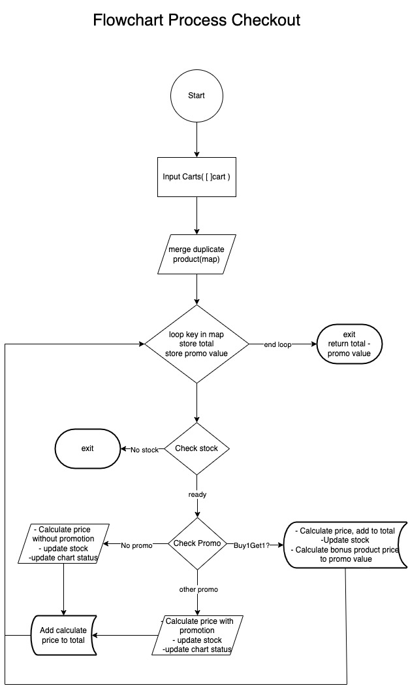

# Simple Inventory

```
Simple Inventory backend service using GraphQL handling a simple ecommerce-like service.
```
This service supports:
1. Product Management (Add - Lists - Update)
2. Promo Management (Add - Lists - Update)
3. Cart Management (Add - list)
4. Checkout Process 

This service is handling following promotions when a checkout process.
1. Buy 1 Product X Get 1 Free Product Y
2. Buy 3 Products X, Pay Only 2 Product X
3. Buy Min 3 Products X, Get 10% Discount for purchases of Products X

Based on these requirements, I define three general rules.
1. Buy 1 Get 1 - Buy1Get1
2. Buy X Pay Y - BuyXPayY
3. Buy Min X, OFF Y% - Discount with minimum quantity

### Running Application
1. Execute models/query.sql to create table on database
2. Update .env base on your database config
3. go build
4. ./kuncie
5. go to http://localhost:8080/ to open GraphQL playground

The flowchart checkout process



## Example query and mutation

## Mutation Create Product
Create new product
```
mutation createProduct{
  createProduct(input: {sku:"234234", name:"Raspberry Pi B", price:30.0, quantity:2}) {
    ID
  }
}
```

## Mutation Update Product
Update product by SKU
```
mutation updateProduct {
  updateProduct(input: {sku:"234234", name:"Raspberry Pi B", price:30.0, quantity:5}) {
    status
  }
}
```

## Mutation Create Promo
Create new promo
```
mutation createPromo {
  createPromo(input: {sku:"1304SD", promotype:"DISCOUNT", promodetail:{bonussku:"", minqty: 3, payonly:0, discount:10}}) {
    ID
  }
}
```

## Mutation Update Promo
Update promo
```
mutation updatePromo {
  updatePromo(input: {sku:"A304SD", promotype:"DISCOUNT", promodetail:{bonussku:"", minqty: 5, payonly:0, discount:15}}) {
    status
  }
}
```

## Mutation AddCart
Add product to cart
```
mutation addCart {
  addCart(input:{sku: "A304SD",quantity: 1}){
    ID,
    sku,
    quantity
  }
}
```

## Query Get Product by SKU
Get product by SKU
```
query findProduct {
  product(sku:"A304SD") {
    ID
    name
    price
    quantity
    
  }
}
```

## Query Get All Product
Get All Product
```
query getAllProduct {
  products{
    ID
    name
    sku
    price
    quantity
  }
}
```

## Query Get Promo by SKU
Get promo bu SKU
```
query getPromo {
  promo(sku:"A304SD") {
    ID,
    promotype,
    bonussku,
    minqty,
    payonly,
    discount
  }
}
```

## Query Get All Promo
get All Promo
```
query getAllPromo {
  promolist {
    ID,
    promotype,
    bonussku,
    minqty,
    payonly,
    discount
  }
}
```

## Query Get All Cart
Get All Cart with status 0 (open)
```
query getAllCart {
  cartlist{
    ID,
    sku,
    quantity
  }
}
```

## Query Checkout
Checkout with carts
```
query checkout {
  checkout(input: {contents:[{sku: "A304SD",quantity: 1},{ sku: "A304SD", quantity:1}, { sku: "A304SD", quantity:1}]}) {
    total
  }
}
```